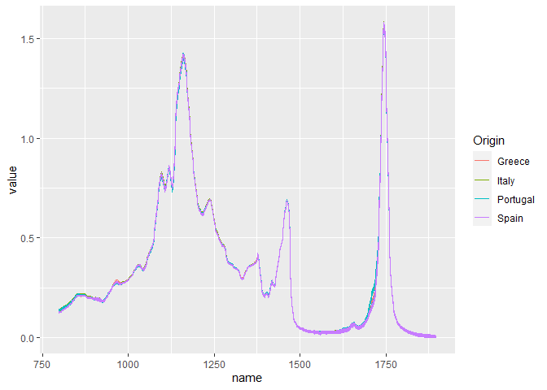

Olive Oil - NIR classification
================
Patternverse
2022-11-21

### Data upload

Let’s start with data download. Unfortunately, we have to download a
zipped folder and then only extract two files (a `readme.txt` and
`FTIR_Spectra_olive_oils.csv`)

### Data preparation

Just from the `str()` it is not clear what the dataset looks like. Let’s
check the file:

``` r
oil[1:5,1:5]
```

    ##                         V1          V2          V3          V4          V5
    ## Sample.Number. Group Code: Wavenumbers     798.892    800.8215     802.751
    ## X1                       1      Greece 0.127523009 0.127949615 0.129282219
    ## X1.1                     1      Greece 0.126498181 0.127130974 0.128510777
    ## X2                       1      Greece 0.130411785 0.130675401  0.13201661
    ## X2.1                     1      Greece 0.130022227 0.130406662 0.132018029

We need to use the first row as the `colnames`, then remove the first
row. We can also remove the row names, as in the original file those
were duplicated sample numbers (each sample was scanned twice). We also
will need to change the colname of the country of origin. Also, all the
datapoints need to be converted to numeric. We will convert the
`Group Code` column to be able to identify each scan, and rename it to
`Scan`

``` r
colnames(oil) <- oil[1,] # changing the column names
oil2 <- oil[-1,]# removing the first row
oil2 <- oil2 %>% rename(Scan=`Group Code:`, Origin=Wavenumbers) %>% mutate(Scan=1:120)# renaming two columns; Scan column will have unique numbers
rownames(oil2) <- NULL # removing row names
oil2[,3:ncol(oil2)] <- apply(oil2[,3:ncol(oil2)],2,as.numeric) # changing the class of NIR data
oil2[,2] <- as.factor(oil2[,2])
oil2[1:5,1:5]
```

    ##   Scan Origin   798.892  800.8215   802.751
    ## 1    1 Greece 0.1275230 0.1279496 0.1292822
    ## 2    2 Greece 0.1264982 0.1271310 0.1285108
    ## 3    3 Greece 0.1304118 0.1306754 0.1320166
    ## 4    4 Greece 0.1300222 0.1304067 0.1320180
    ## 5    5 Greece 0.1286020 0.1287896 0.1300223

Now our data frame contains relevant infromation: country of origin
(first column) stored as a factor, and and wavelength number at the top
of a relevant column (as numeric values).

### Data visualization

Let’s start with visualizing the sample. We need to change the format of
the file to a long one.

``` r
oil2 %>% pivot_longer(cols=-c(1,2)) %>% mutate(name=as.numeric(name)) %>% 
  ggplot(aes(name,value, group=Scan, color=Origin))+geom_line()+theme_gray()
```

<div class="figure" style="text-align: center">


<p class="caption">
Fig. 1-1 Data as received
</p>

</div>

### Data transformation

Judging by the Fig. 1-1, The data has been normalized. We can attempt
the PLS classification.
